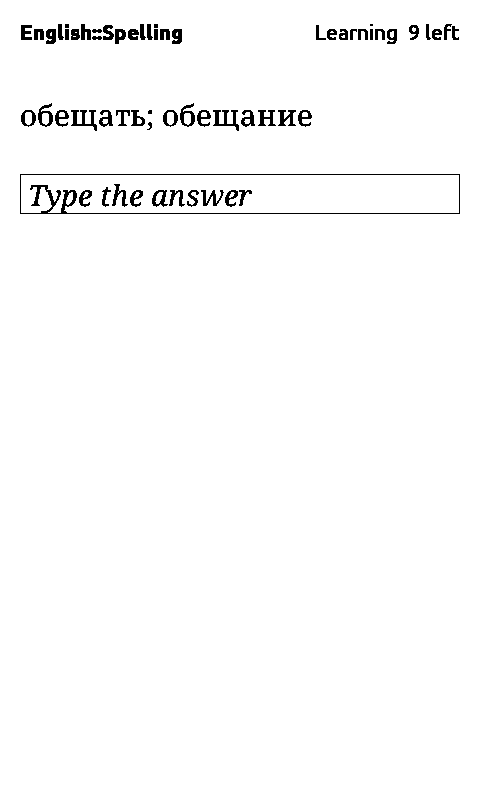
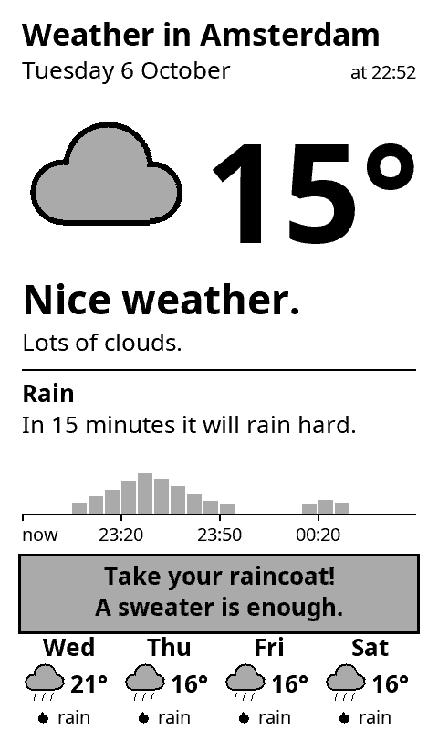
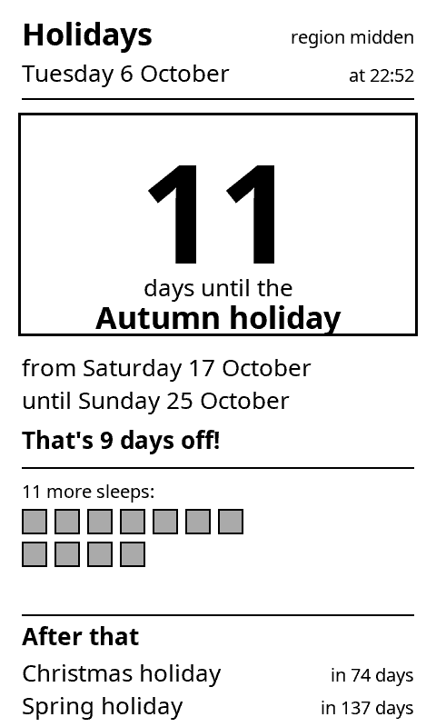
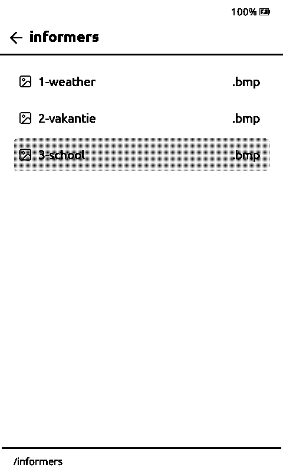
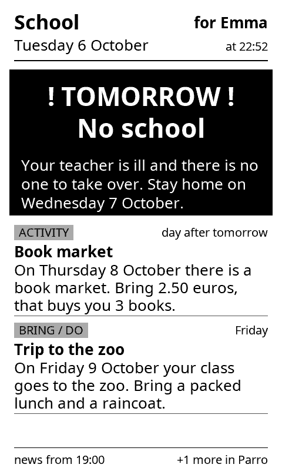
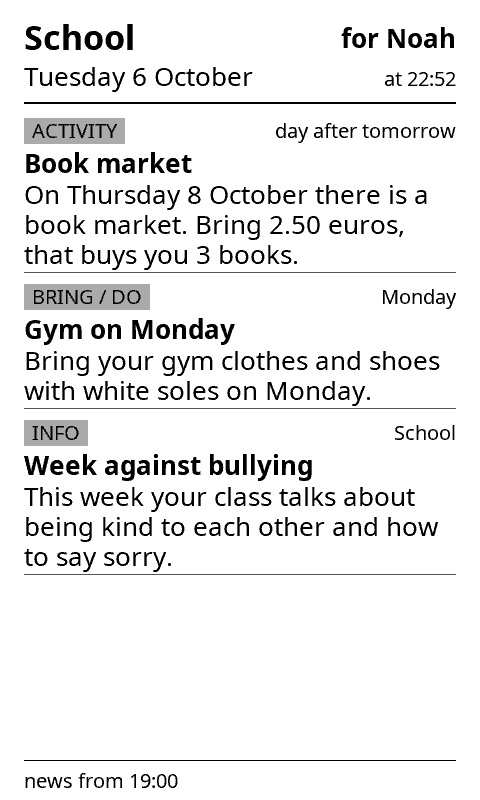

# crosspoint-anki

[CrossPoint Reader](https://github.com/crosspoint-reader/crosspoint-reader) firmware with [Anki](https://apps.ankiweb.net/) built in.
Plus [informers](#informers): weather, school news and other screens refreshed while the reader sleeps. Everything else is stock CrossPoint ([upstream README](https://github.com/crosspoint-reader/crosspoint-reader#readme)).

**Needs a server on your network:** either [AnkiDo](https://github.com/H1D/AnkiDo) (syncs with AnkiWeb for you) or Anki desktop with the [AnkiConnect](https://ankiweb.net/shared/info/2055492159) add-on (the reader talks to Anki on your PC directly; AnkiConnect must listen on your LAN address, see its `webBindAddress` setting).

## Features

| | |
|---|---|
|  | **Anki on the home screen.** |
|  | **Review cards.** Confirm flips. Left = Again, Right = Good, side Down = Hard, side Up = Easy (or tap the strips). Anki does the scheduling. |
|  | **Type-in cards.** Cards with `{{type:Field}}` show a box: tap it (or Confirm) to type the answer, OK shows the answer side with Anki's comparison: your typing over the correct answer, mistakes inverted. `{{type:nc:Field}}` ignores accents; `{{type:cloze:Text}}` works too. The keyboard opens on a layout for the answer's script, and Settings → Keyboard layouts has English, German (ä ö ü ß), French, Spanish, Italian, Portuguese, Dutch and Polish with their accented letters. AnkiDo needs to send the expected answer (`type_answer`, added to AnkiDo after 0.3.0); with an older server you can still type but get no comparison. |
|  | **Add a word from a book.** Long-press a word (or reader menu → Add to Anki): its translation opens with an **Add to Anki** button. The add screen previews the card (front: the word's dictionary form, the example sentence, back: just its translations) above your accounts. Tick one or more, each row shows its deck (hold a row to pick another; the last deck used is remembered), **Add**. |
|  | **Dictionaries per book language.** Put one [StarDict](docs/dictionary.md) dictionary per language in `/dictionaries/` ([WikDict](https://download.wikdict.com/dictionaries/stardict/) has most pairs); each book uses the one for its own language. Inflected words find their dictionary form (Dutch *staarde* → *staren*, *weilanden* → *weiland*; English *walked* → *walk*), and WikDict entries show as meaning → translations. Works without Anki too: long-press looks the word up. |
|  | **Offline first.** Cards are cached on the SD card; grades and new notes queue up and sync on demand, when you leave the review screen, or when the device goes to sleep. |

## Reading

**Font per book.** A font or size picked inside a book (reader menu → Text) sticks to that book. **Settings → Reader → Default Font** sets the font for every other book. In a book's font list the default is marked **Default**; picking it puts the book back on the default.

## Informers

Small glanceable screens drawn by a Cloudflare Worker and shown as images: the reader downloads them each time it goes to sleep, and wakes itself at times a plugin asks for to refresh them. Adding one needs no firmware build: a Worker module plus an SD-card plugin folder ([informers/README.md](informers/README.md)). Every informer has 4-level gray and black-and-white versions, in Dutch or English (`lang` in the plugin's `config.json`).

| | | |
|---|---|---|
|  |  |  |
| **Weather** for a child: temperature, rain in the next 2 hours (Buienalarm), what to wear, the next 4 days (Buienradar). | **Holiday countdown**: days to the next Dutch school holiday for your region. | **Open them** from Browse Files → `informers`; Left and Right flip between them. Any one can be the sleep screen. |
|  |  | |
| **School news per child** from Parro, rewritten short and simple. "No school tomorrow" takes over the top. | The same evening on a sibling's reader: only news for that child's class. | A job on a home server pulls Parro at 07:50 and 19:00 ([informers/school](informers/school/README.md)); the readers wake at 07:55 and 19:05 to show it on their sleep screen. |

Plugin refresh times are a firmware feature (`"wake": ["07:55", "19:05"]` on a `sleep.enter` handler, [docs/plugin-events.md](docs/plugin-events.md)), built on the timer-wake primitive from upstream [#3820](https://github.com/crosspoint-reader/crosspoint-reader/pull/3820). Screenshots show demo data.

## Flash

**<https://h1d.github.io/crosspoint-anki/>** — Chrome or Edge, USB cable, pick your device and release, Connect & Flash.

Then set up an account: File Transfer on the reader → `http://<reader-ip>/settings` → Anki accounts. Pick the server type, then either AnkiDo URL, profile and token (from `ankido token create --profile <name> --scopes read,review,add`), or the AnkiConnect URL (`http://<pc-ip>:8765`), optionally the Anki profile to load and the add-on's API key. Or drop `/.crosspoint/anki.json` on the SD card:

```json
{"accounts":[
  {"name":"me","url":"http://192.168.1.10:8766","profile":"me","token":"akd_...","enabled":true},
  {"name":"pc","backend":"ankiconnect","url":"http://192.168.1.20:8765","enabled":true}
]}
```

With AnkiConnect the grade buttons show no "next interval" hints (the add-on has no preview call), and reviews are dated at sync time.

Updates: Settings → System → Check for updates.

Notes: [docs/anki/DECISIONS.md](docs/anki/DECISIONS.md) · [docs/anki/ARCHITECTURE.md](docs/anki/ARCHITECTURE.md) · [LICENSE](LICENSE)
