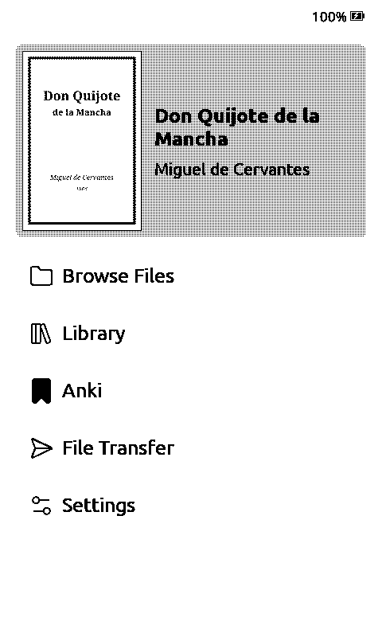
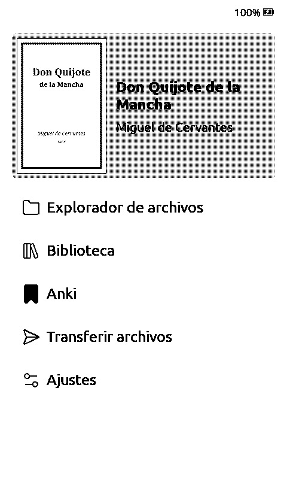
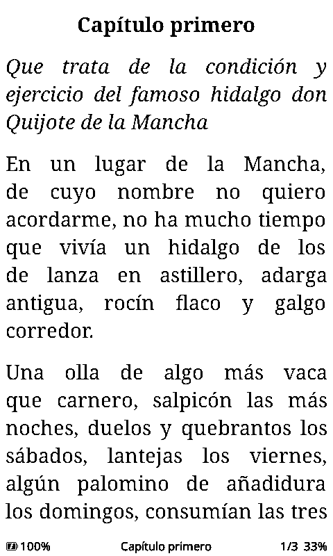
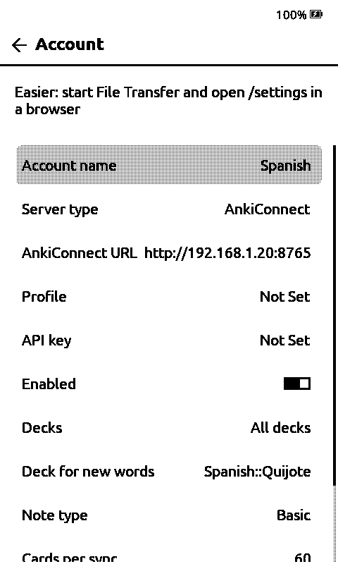

# crosspoint-anki

[CrossPoint Reader](https://github.com/crosspoint-reader/crosspoint-reader) firmware with [Anki](https://apps.ankiweb.net/) built in.
Everything else is stock CrossPoint ([upstream README](https://github.com/crosspoint-reader/crosspoint-reader#readme)).

**Needs a server on your network:** either [AnkiDo](https://github.com/H1D/AnkiDo) (syncs with AnkiWeb for you) or Anki desktop with the [AnkiConnect](https://ankiweb.net/shared/info/2055492159) add-on (the reader talks to Anki on your PC directly; AnkiConnect must listen on your LAN address, see its `webBindAddress` setting).

## Features

| | |
|---|---|
|  | **Anki on the home screen.** |
|  | **Review cards.** Confirm flips. Left = Again, Right = Good, side Down = Hard, side Up = Easy (or tap the strips). Anki does the scheduling. |
|  | **Add a word from a book.** Long-press a word (or reader menu → Add to Anki), confirm it, tick one or more accounts (each row shows its deck; long-press a row to pick another), **Add**. Front: the word's dictionary form + the sentence. Back: just its translations, if a dictionary is set up. |
|  | **Dictionaries per book language.** Put one [StarDict](docs/dictionary.md) dictionary per language in `/dictionaries/` ([WikDict](https://download.wikdict.com/dictionaries/stardict/) has most pairs); each book uses the one for its own language. Inflected words find their dictionary form (Dutch *staarde* → *staren*, *weilanden* → *weiland*; English *walked* → *walk*), and WikDict entries show as meaning → translations. With no Anki account enabled, long-press looks the word up. |
|  | **Offline first.** Cards are cached on the SD card; grades and new notes queue up and sync on demand, when you leave the review screen, or when the device goes to sleep. |

## Flash

**<https://h1d.github.io/crosspoint-anki/>** — Chrome or Edge, USB cable, pick your device and release, Connect & Flash.

Then set up an account: File Transfer on the reader → `http://<reader-ip>/settings` → Anki accounts. Pick the server type, then either AnkiDo URL, profile and token (from `ankido token create --profile <name> --scopes read,review,add`), or the AnkiConnect URL (`http://<pc-ip>:8765`), optionally the Anki profile to load and the add-on's API key. Or drop `/.crosspoint/anki.json` on the SD card:

```json
{"accounts":[
  {"name":"me","url":"http://192.168.1.10:8766","profile":"me","token":"akd_...","enabled":true},
  {"name":"pc","backend":"ankiconnect","url":"http://192.168.1.20:8765","enabled":true}
]}
```

With AnkiConnect the grade buttons show no "next interval" hints (the add-on has no preview call), and reviews are dated at sync time.

Updates: Settings → System → Check for updates.

Notes: [docs/anki/DECISIONS.md](docs/anki/DECISIONS.md) · [docs/anki/ARCHITECTURE.md](docs/anki/ARCHITECTURE.md) · [LICENSE](LICENSE)
