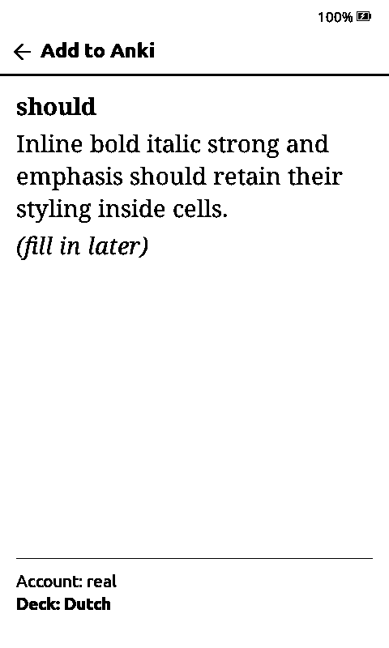

# crosspoint-anki

[CrossPoint Reader](https://github.com/crosspoint-reader/crosspoint-reader) firmware with [Anki](https://apps.ankiweb.net/) built in.
Everything else is stock CrossPoint ([upstream README](https://github.com/crosspoint-reader/crosspoint-reader#readme)).

**Needs an [AnkiDo](https://github.com/H1D/AnkiDo) server** on your network. It syncs with AnkiWeb; the reader only talks to it.

## Features

| | |
|---|---|
|  | **Anki on the home screen.** Pick an account if you have several. |
|   | **Review cards.** Confirm flips. Left = Again, Right = Good, side Down = Hard, side Up = Easy (or tap the strips). Anki does the scheduling. |
|   | **Add a word from a book.** Long-press a word (or reader menu → Add to Anki). Front: word + sentence. Back: dictionary translation, if a dictionary is set up. |
|  | **Offline first.** Cards are cached on the SD card; grades and new notes queue up and sync on demand, when you leave the review screen, or when the device goes to sleep. |

## Flash

**<https://h1d.github.io/crosspoint-anki/>** — Chrome or Edge, USB cable, pick your device and release, Connect & Flash.

Then set up an account: File Transfer on the reader → `http://<reader-ip>/settings` → Anki accounts (AnkiDo URL, profile, token from `ankido token create --profile <name> --scopes read,review,add`). Or drop `/.crosspoint/anki.json` on the SD card:

```json
{"accounts":[{"name":"me","url":"http://192.168.1.10:8766","profile":"me","token":"akd_...","enabled":true}]}
```

Updates: Settings → System → Check for updates.

Notes: [docs/anki/DECISIONS.md](docs/anki/DECISIONS.md) · [docs/anki/ARCHITECTURE.md](docs/anki/ARCHITECTURE.md) · [LICENSE](LICENSE)
